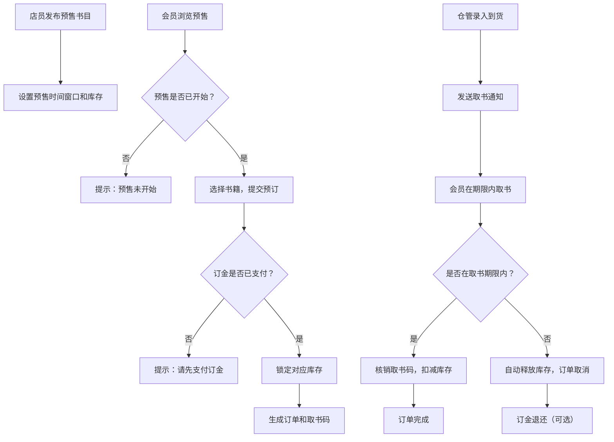

## 1. 产品概述

书店会员预售系统是一个面向书店店员、会员和仓管的协同全栈应用，实现预售书目发布、订金支付、库存锁定、到货通知和取书管理的完整业务闭环。

- 核心目的：解决书店热门新书预售的库存管理问题，通过订金机制锁定真实购买需求，避免超售或缺货
- 目标用户：书店店员（发布预售）、会员（预订支付）、仓管（库存管理）
- 市场价值：提升会员购买体验，优化库存周转，降低运营成本

## 2. 核心功能

### 2.1 用户角色

| 角色 | 登录方式 | 核心权限 |
|------|----------|----------|
| 店员 | 账号密码登录 | 发布预售书目、设置预售时间窗口、查看订单、管理取书状态 |
| 会员 | 账号密码登录 | 浏览预售书目、支付订金、查看订单、取书核销 |
| 仓管 | 账号密码登录 | 录入到货信息、发送取书通知、释放逾期库存 |

### 2.2 功能模块

1. **预售页面**：预售书目列表、预售详情、时间窗口展示、订金支付
2. **订单页面**：我的订单列表、订单详情、支付状态、取书状态
3. **取书页面**：取书核销、取书通知、逾期提醒、库存释放

### 2.3 页面详情

| 页面名称 | 模块名称 | 功能描述 |
|---------|----------|----------|
| 预售页面 | 书目列表 | 展示所有预售书目，显示预售状态、剩余时间、价格、订金 |
| 预售页面 | 预售详情 | 展示书籍详情、预售时间窗口、库存数量、已预订数量 |
| 预售页面 | 订金支付 | 选择预订数量、确认订金、完成支付、锁定库存 |
| 订单页面 | 订单列表 | 展示我的所有预售订单，按状态筛选（待支付、已支付、待取书、已完成、已取消） |
| 订单页面 | 订单详情 | 订单信息、支付记录、取书码、取书期限 |
| 取书页面 | 取书核销 | 扫描/输入取书码、确认取书、扣减库存、完成订单 |
| 取书页面 | 到货通知 | 仓管录入到货、批量发送取书通知给已支付会员 |
| 取书页面 | 逾期处理 | 自动识别逾期订单、释放锁定库存、标记订单取消 |

## 3. 核心流程

### 业务规则：
- 预售未开始不能下订
- 订金未付不能锁库存
- 超过取书期限自动释放库存

### 主流程图：

## 4. 用户界面设计

### 4.1 设计风格
- 主色调：深棕色 (#3E2723) + 米白色 (#FAFAF5)，营造书店温暖知性的氛围
- 辅助色：琥珀金 (#D4AF37) 用于强调按钮和状态
- 按钮风格：圆角 8px，微立体阴影，hover 有轻微上浮效果
- 字体：标题使用思源宋体，正文使用思源黑体，体现文化质感
- 布局风格：卡片式布局，顶部导航，左侧角色切换
- 图标风格：线性图标，配合书卷、羽毛笔等书店元素

### 4.2 页面设计概览

| 页面名称 | 模块名称 | UI 元素 |
|---------|----------|---------|
| 预售页面 | 书目列表 | 书籍封面卡片网格、预售倒计时徽标、价格标签、库存进度条 |
| 预售页面 | 预售详情 | 大图展示、书籍信息、时间轴展示预售阶段、支付按钮组 |
| 订单页面 | 订单列表 | 时间线式订单卡片、状态徽章、筛选标签页 |
| 取书页面 | 取书核销 | 扫码框、取书码输入、核销动画、确认弹窗 |
| 取书页面 | 到货通知 | 待通知列表、批量操作按钮、通知状态进度条 |

### 4.3 响应式设计
- 桌面端优先设计，适配 1280px 以上屏幕
- 平板端：卡片网格改为 2 列，导航压缩
- 移动端：单列布局，底部导航栏，触摸优化按钮尺寸

### 4.4 交互动效
- 页面加载：元素错落淡入，首屏加载时长控制在 1s 内
- 按钮交互：hover 微放大 + 阴影加深，click 按压反馈
- 状态切换：平滑过渡动画，支付成功有庆祝动效
- 倒计时：数字滚动效果，临近结束时颜色变为红色警示
