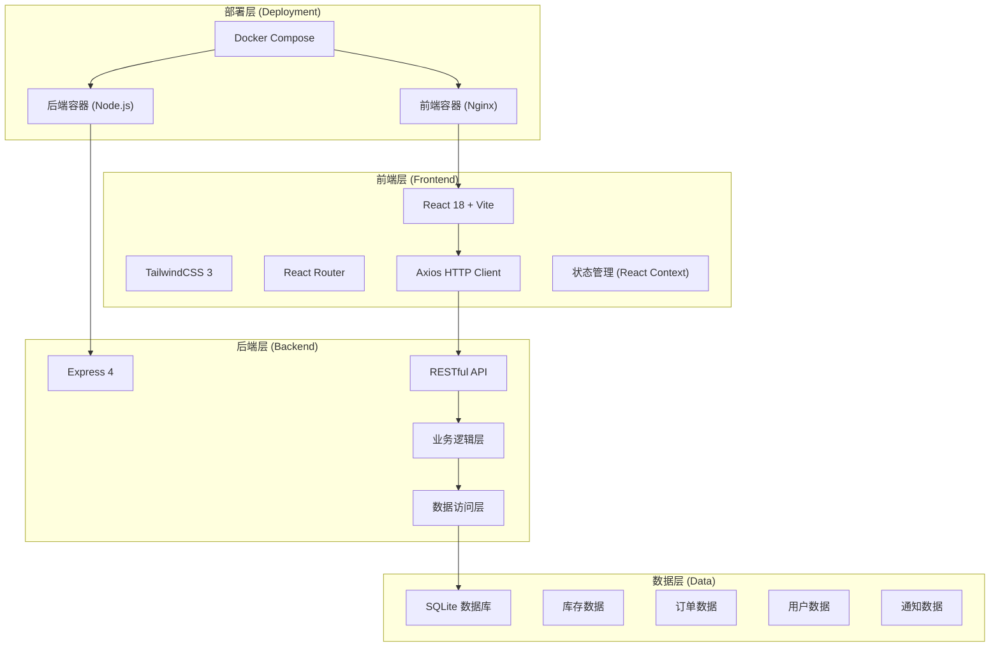
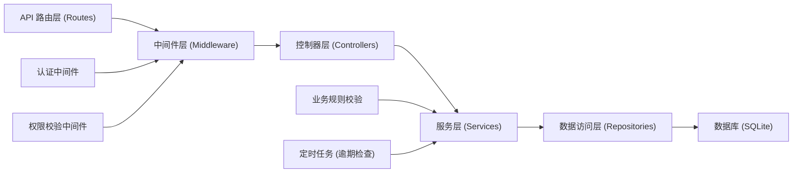
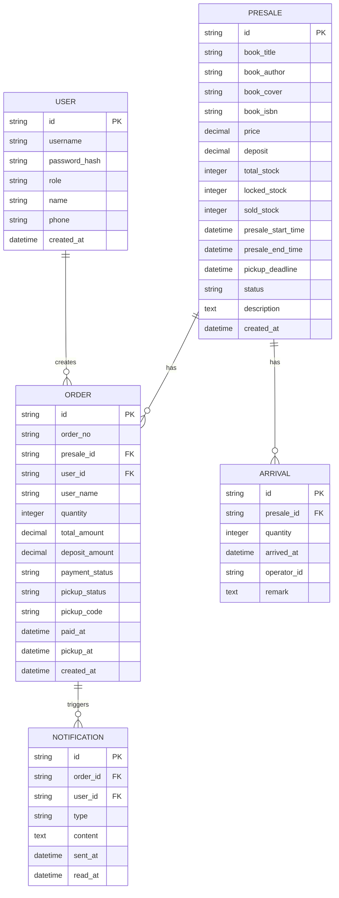

## 1. 架构设计



## 2. 技术描述

- **前端框架**：React 18 + Vite 5 + TailwindCSS 3
- **路由管理**：React Router v6
- **HTTP 客户端**：Axios
- **状态管理**：React Context + useReducer
- **后端框架**：Express 4
- **运行环境**：Node.js 18+
- **数据库**：SQLite 3（开发/测试环境）
- **容器化**：Docker + Docker Compose
- **代码规范**：ESLint + Prettier

## 3. 路由定义

### 前端路由

| 路由路径 | 页面名称 | 权限要求 | 说明 |
|---------|----------|----------|------|
| `/login` | 登录页 | 公开 | 角色选择和账号登录 |
| `/presale` | 预售页面 | 会员/店员 | 浏览预售书目、支付订金 |
| `/presale/:id` | 预售详情 | 会员/店员 | 查看预售详情、提交预订 |
| `/orders` | 订单页面 | 会员/店员 | 查看订单列表和详情 |
| `/pickup` | 取书页面 | 仓管/店员/会员 | 取书核销、到货通知 |
| `/admin/presale` | 预售管理 | 店员 | 发布/管理预售书目 |

### 后端 API 路由

| 方法 | 路径 | 模块 | 说明 |
|------|------|------|------|
| POST | `/api/auth/login` | 认证 | 用户登录 |
| GET | `/api/presales` | 预售 | 获取预售列表 |
| GET | `/api/presales/:id` | 预售 | 获取预售详情 |
| POST | `/api/presales` | 预售 | 店员创建预售 |
| PUT | `/api/presales/:id` | 预售 | 更新预售信息 |
| POST | `/api/orders` | 订单 | 创建预订订单 |
| GET | `/api/orders` | 订单 | 获取订单列表 |
| GET | `/api/orders/:id` | 订单 | 获取订单详情 |
| POST | `/api/orders/:id/pay` | 订单 | 支付订金 |
| POST | `/api/orders/:id/pickup` | 订单 | 取书核销 |
| POST | `/api/arrivals` | 库存 | 录入到货信息 |
| POST | `/api/notifications/send` | 通知 | 发送取书通知 |
| POST | `/api/orders/:id/release` | 订单 | 释放逾期库存 |

## 4. API 定义

### 数据类型定义

```typescript
// 用户类型
interface User {
  id: string;
  username: string;
  role: 'clerk' | 'member' | 'warehouse';
  name: string;
  phone: string;
}

// 预售书目
interface Presale {
  id: string;
  bookId: string;
  bookTitle: string;
  bookAuthor: string;
  bookCover: string;
  bookIsbn: string;
  price: number;
  deposit: number;
  totalStock: number;
  lockedStock: number;
  soldStock: number;
  presaleStartTime: string;
  presaleEndTime: string;
  pickupDeadline: string;
  status: 'draft' | 'upcoming' | 'active' | 'ended' | 'arrived';
  description: string;
  createdAt: string;
}

// 订单
interface Order {
  id: string;
  orderNo: string;
  presaleId: string;
  userId: string;
  userName: string;
  quantity: number;
  totalAmount: number;
  depositAmount: number;
  paymentStatus: 'unpaid' | 'paid' | 'refunded';
  pickupStatus: 'pending' | 'ready' | 'picked' | 'expired';
  pickupCode: string;
  paidAt: string | null;
  pickupAt: string | null;
  createdAt: string;
}

// 到货记录
interface Arrival {
  id: string;
  presaleId: string;
  quantity: number;
  arrivedAt: string;
  operatorId: string;
  remark: string;
}

// 通知记录
interface Notification {
  id: string;
  orderId: string;
  userId: string;
  type: 'pickup_ready' | 'expiry_warning' | 'order_cancelled';
  content: string;
  sentAt: string;
  readAt: string | null;
}
```

### 请求/响应示例

**登录请求**
```typescript
// Request
POST /api/auth/login
{
  "username": "member001",
  "password": "password",
  "role": "member"
}

// Response
{
  "code": 200,
  "message": "success",
  "data": {
    "token": "jwt-token-string",
    "user": {
      "id": "u001",
      "username": "member001",
      "role": "member",
      "name": "张三",
      "phone": "13800138000"
    }
  }
}
```

**创建订单请求**
```typescript
// Request
POST /api/orders
{
  "presaleId": "p001",
  "quantity": 1
}

// Response
{
  "code": 200,
  "message": "success",
  "data": {
    "id": "o001",
    "orderNo": "PS202401010001",
    "paymentStatus": "unpaid",
    "pickupStatus": "pending",
    "pickupCode": "A1B2C3"
  }
}
```

## 5. 服务端架构图



### 目录结构

```
backend/
├── src/
│   ├── config/          # 配置文件
│   ├── controllers/     # 控制器
│   ├── middleware/      # 中间件
│   ├── models/          # 数据模型
│   ├── repositories/    # 数据访问
│   ├── routes/          # 路由定义
│   ├── services/        # 业务逻辑
│   ├── utils/           # 工具函数
│   ├── database.js      # 数据库连接
│   └── server.js        # 入口文件
├── data/                # SQLite 数据文件
└── package.json
```

## 6. 数据模型

### 6.1 ER 图



### 6.2 DDL 语句

```sql
-- 用户表
CREATE TABLE IF NOT EXISTS users (
    id TEXT PRIMARY KEY,
    username TEXT UNIQUE NOT NULL,
    password_hash TEXT NOT NULL,
    role TEXT NOT NULL CHECK (role IN ('clerk', 'member', 'warehouse')),
    name TEXT NOT NULL,
    phone TEXT,
    created_at DATETIME DEFAULT CURRENT_TIMESTAMP
);

-- 预售表
CREATE TABLE IF NOT EXISTS presales (
    id TEXT PRIMARY KEY,
    book_title TEXT NOT NULL,
    book_author TEXT NOT NULL,
    book_cover TEXT,
    book_isbn TEXT,
    price DECIMAL(10,2) NOT NULL,
    deposit DECIMAL(10,2) NOT NULL,
    total_stock INTEGER NOT NULL DEFAULT 0,
    locked_stock INTEGER NOT NULL DEFAULT 0,
    sold_stock INTEGER NOT NULL DEFAULT 0,
    presale_start_time DATETIME NOT NULL,
    presale_end_time DATETIME NOT NULL,
    pickup_deadline DATETIME NOT NULL,
    status TEXT NOT NULL DEFAULT 'draft' CHECK (status IN ('draft', 'upcoming', 'active', 'ended', 'arrived')),
    description TEXT,
    created_at DATETIME DEFAULT CURRENT_TIMESTAMP
);

-- 订单表
CREATE TABLE IF NOT EXISTS orders (
    id TEXT PRIMARY KEY,
    order_no TEXT UNIQUE NOT NULL,
    presale_id TEXT NOT NULL REFERENCES presales(id),
    user_id TEXT NOT NULL REFERENCES users(id),
    user_name TEXT NOT NULL,
    quantity INTEGER NOT NULL DEFAULT 1,
    total_amount DECIMAL(10,2) NOT NULL,
    deposit_amount DECIMAL(10,2) NOT NULL,
    payment_status TEXT NOT NULL DEFAULT 'unpaid' CHECK (payment_status IN ('unpaid', 'paid', 'refunded')),
    pickup_status TEXT NOT NULL DEFAULT 'pending' CHECK (pickup_status IN ('pending', 'ready', 'picked', 'expired')),
    pickup_code TEXT UNIQUE,
    paid_at DATETIME,
    pickup_at DATETIME,
    created_at DATETIME DEFAULT CURRENT_TIMESTAMP
);

-- 到货表
CREATE TABLE IF NOT EXISTS arrivals (
    id TEXT PRIMARY KEY,
    presale_id TEXT NOT NULL REFERENCES presales(id),
    quantity INTEGER NOT NULL,
    arrived_at DATETIME DEFAULT CURRENT_TIMESTAMP,
    operator_id TEXT NOT NULL REFERENCES users(id),
    remark TEXT
);

-- 通知表
CREATE TABLE IF NOT EXISTS notifications (
    id TEXT PRIMARY KEY,
    order_id TEXT NOT NULL REFERENCES orders(id),
    user_id TEXT NOT NULL REFERENCES users(id),
    type TEXT NOT NULL CHECK (type IN ('pickup_ready', 'expiry_warning', 'order_cancelled')),
    content TEXT NOT NULL,
    sent_at DATETIME DEFAULT CURRENT_TIMESTAMP,
    read_at DATETIME
);

-- 索引
CREATE INDEX IF NOT EXISTS idx_orders_presale_id ON orders(presale_id);
CREATE INDEX IF NOT EXISTS idx_orders_user_id ON orders(user_id);
CREATE INDEX IF NOT EXISTS idx_orders_pickup_code ON orders(pickup_code);
CREATE INDEX IF NOT EXISTS idx_presales_status ON presales(status);
CREATE INDEX IF NOT EXISTS idx_notifications_user_id ON notifications(user_id);
```

### 6.3 初始化数据

```sql
-- 初始化测试用户
INSERT INTO users (id, username, password_hash, role, name, phone) VALUES
('u_clerk', 'clerk001', 'hashed_password', 'clerk', '李店员', '13800138001'),
('u_member', 'member001', 'hashed_password', 'member', '王会员', '13800138002'),
('u_warehouse', 'warehouse001', 'hashed_password', 'warehouse', '张仓管', '13800138003');

-- 初始化预售数据
INSERT INTO presales (id, book_title, book_author, book_cover, book_isbn, price, deposit, total_stock, presale_start_time, presale_end_time, pickup_deadline, status, description) VALUES
('p_001', '百年孤独', '加西亚·马尔克斯', 'https://trae-api-cn.mchost.guru/api/ide/v1/text_to_image?prompt=book%20cover%20of%20One%20Hundred%20Years%20of%20Solitude&image_size=portrait_4_3', '9787544253994', 59.80, 20.00, 100, DATETIME('now', '+1 hour'), DATETIME('now', '+7 days'), DATETIME('now', '+14 days'), 'upcoming', '诺贝尔文学奖代表作，魔幻现实主义经典'),
('p_002', '活着', '余华', 'https://trae-api-cn.mchost.guru/api/ide/v1/text_to_image?prompt=book%20cover%20of%20To%20Live%20by%20Yu%20Hua&image_size=portrait_4_3', '9787506365437', 39.00, 15.00, 50, DATETIME('now', '-1 hour'), DATETIME('now', '+5 days'), DATETIME('now', '+12 days'), 'active', '余华代表作，讲述一个人和他的命运之间的友情');
```
